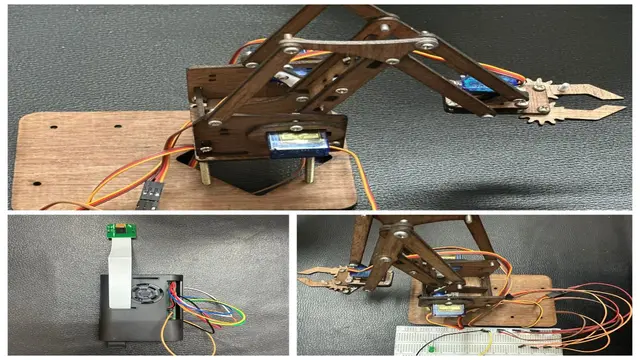

# Automated-Waste-Segregation-System [Object Detection & Robotic Interaction with Raspberry Pi]

## Overview
This project focuses on the integration of **Raspberry Pi** and **OpenCV** to develop an object detection system capable of recognizing and interacting with three different types of objects. The system is further enhanced by a robotic arm that can be controlled based on the detected objects. The implementation showcases the use of **computer vision** to improve efficiency and precision in **Industry 4.0** applications, particularly in **manufacturing** and **automation**.

## Features
- **Object Detection**: Utilizes a Raspberry Pi camera and OpenCV for real-time detection and classification of objects.
- **Robotic Interaction**: A robotic arm is integrated with AngularServo to interact with objects based on detected positions.
- **Cost-Effective Solution**: The system leverages cost-effective computing with Raspberry Pi, which transfers video processing from the camera to the embedded system.
  
## Components Used
- **Raspberry Pi 4B** (1.4 GHz 64-bit processor, 8GB RAM)
- **Raspberry Pi Camera**
- **Angular Servo**
- **OpenCV** (Open Source Computer Vision Library)
- **GPIO Pins** for control

## Workflow

1. **Object Detection**: The system uses a Pi camera along with OpenCV to detect objects like plastic, humans, and cell phones. The live feed analysis can identify objects with varying accuracy.
2. **Robotic Arm Control**: Based on the detected object, the robotic arm moves to interact with the object using AngularServo and GPIO control.
3. **Feedback**: The system provides visual feedback with light displays to indicate successful identification and targeting.

## Results
The system successfully identified everyday objects, achieving recognition accuracy of (for example):
- **Plastic**: 70% certainty

These results highlight the system's effectiveness in real-world applications such as security, waste management, and smart environments.

## Future Improvements
- Expanding the system to detect a wider variety of objects.
- Integrating more advanced machine learning algorithms for improved accuracy.
- Adding mobility to the robotic arm for enhanced interaction capabilities.

## License
This project is licensed under the MIT License - see the [LICENSE](LICENSE) file for details.

## References

1. Serrano-Ramírez, T., et al. (2021). *Artificial vision system for object classification in real time using Raspberry Pi and a Web camera*. Revista Tecnologías de La Información y Comunicaciones. https://doi.org/10.35429/JITC.2021.13.5.20.25
2. Konaite, M., et al. (2021). *Smart Hat for the blind with Real-Time Object Detection using Raspberry Pi and TensorFlow Lite*. International Conference on Artificial Intelligence and Its Applications. https://doi.org/10.1145/3487923.3487929
3. Mahalingam, P., et al. (2019). *Real-Time Text Detection and Shopping Assistance for the Visually Impaired*. International Journal of Psychosocial Rehabilitation. https://doi.org/10.37200/IJPR/V23I4/PR190386
4. Object and Animal Recognition With Raspberry Pi and OpenCV. (n.d.). Core Electronics. https://core-electronics.com.au/guides/raspberry-pi/object-identify-raspberry-pi
